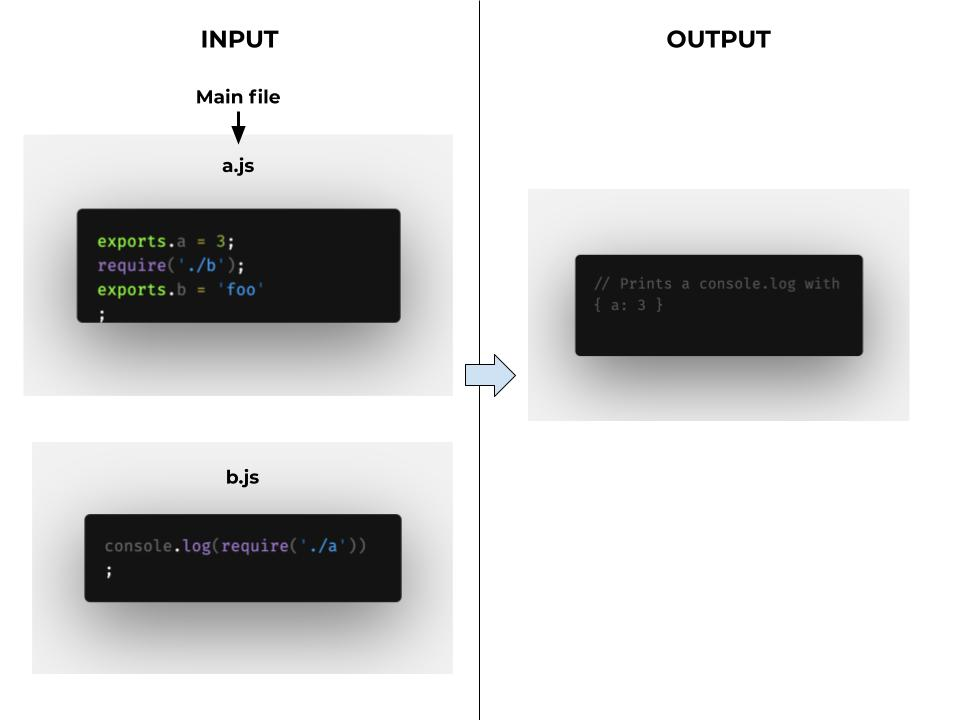

## mini JS bundler 

A simple js bundler with no config but the main file as a unique argument, works with commonjs modules. Totally commonjs complaint (see [doc](http://wiki.commonjs.org/wiki/Modules/1.1))



### How works

* It resolves the DFS three of requires dependencies by using the Babel parser and the Babel translator.
* It overrides the `exports` attribute and the `require` method for each file and it creates a unique scope for each of them.
* Concat all the modules!
* Execute the main one!
* ???
* Profit

### How to use it (CLI)

It only accepts a main file:

```sh
// using the main file directly
npm start ../other-things/my-file-with-requires.js
// or...
npm start --main='../other-things/my-file-with-requires.js'
```

By default, the generated file is stored in `dist/output.js`, but you could
modify it by using the `--output` argument:

```sh
npm start ../other-things/my-file-with-requires.js --output='./other-output-name.js'
```


### Check it!

This command compares the bundler output against the node.js output without concatenating the files:

```sh
npm test
```
